# Travel Info Backend

A Node.js and Express server that is crucial to the overall success of the Travel info frontend. As a data storage and authentication system, it'll manage the user's requests and provide a personalised experience to the user along with security and reliability.

Go to:
 - [Kanban Board](#kanban-board)
 - [User Stories](#user-stories)
 - [Routing Diagrams](#routing-diagrams)
 - [Generative AI use](#generative-ai-use)

---

#### What this backend will solve
This backend system addresses the major concerns of data management and security. It also provides scalability which solves the future problem of handling a growing user base and their large amounts of data.

#### User benefits
This system will provide an enhanced user experience as the database can store the user's favourite locations that can be presented upon request. Due to the implementation of authentication and authorisation on every request, the user's personal information and preferences are kept secure. The system store's its contents in the cloud, and thus user's can expect minimal downtime along with fast response times that lead to a better user experience.

#### Benefit to the customer's business
Due to the multiple benefits delivered to the user that improve their experience, one can expect a higher product engagement and customer retention. The impact of this backend may extend to future additions of the application that are merely an extension of the robust backend's existing capabilities. As this backend system can handle scaled growth, the customer can pursue user base growth without worrying about performance issues.

---
### [Kanban Board](#kanban-board)
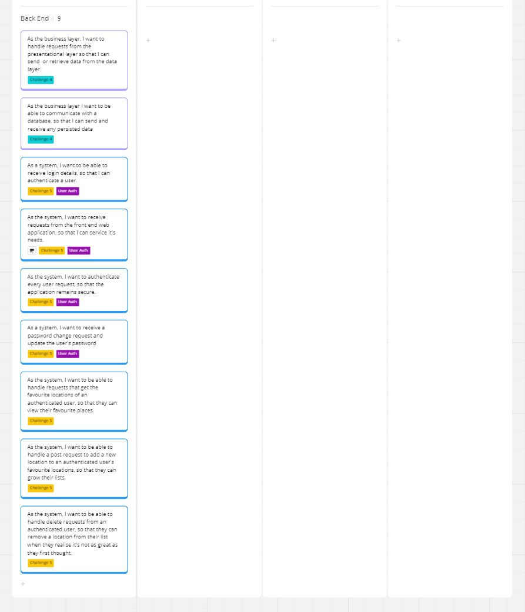

---

### [User Stories](#user-stories)

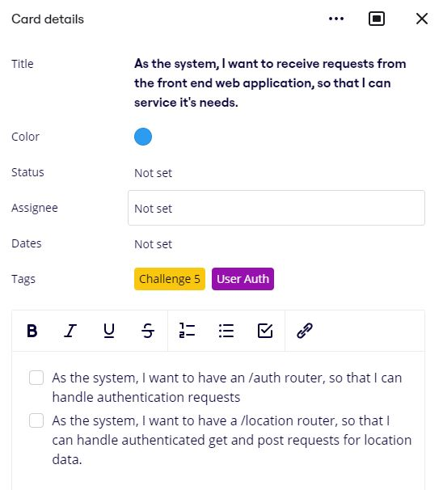
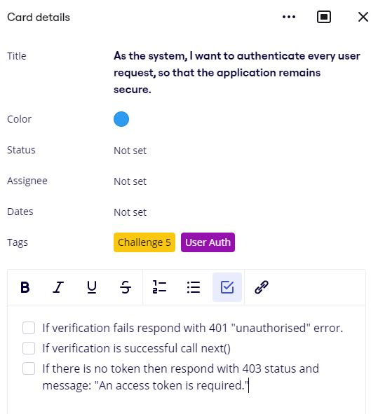
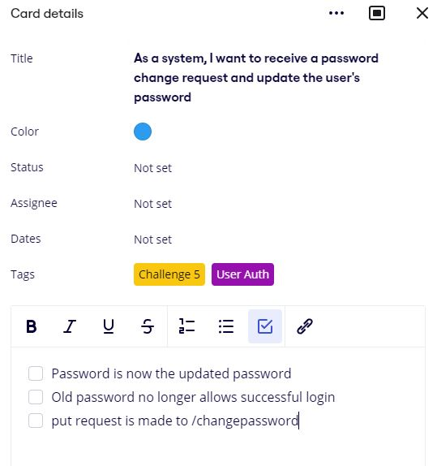
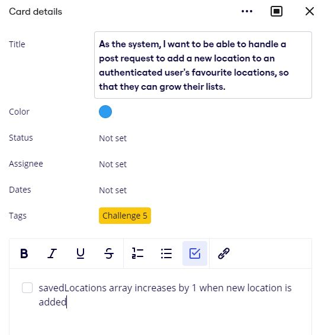
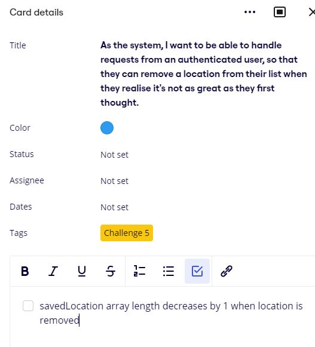

---

### [Routing Diagrams](#routing-diagrams)

#### POST /auth/login
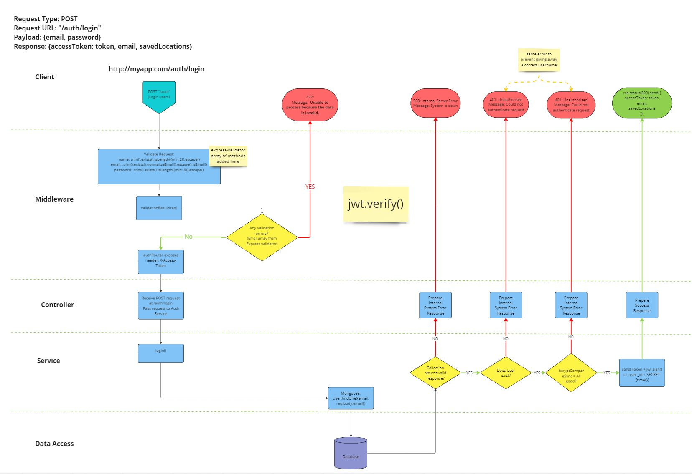

#### POST /auth/signup
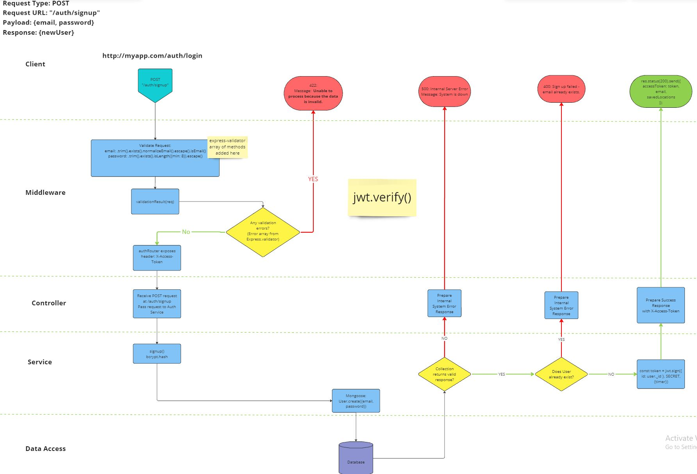

#### PUT /savedLocations
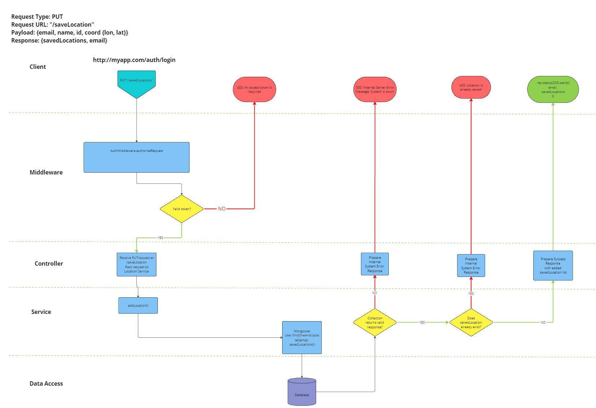

#### PUT /removeLocations

---

### [Generative AI use](#generative-ai-use)
#### SE_BR_2_2
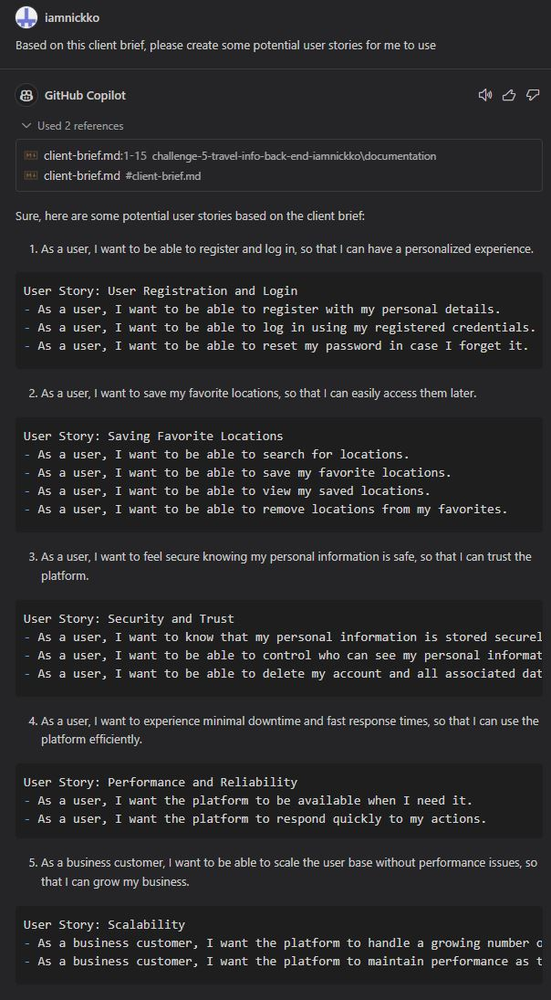
#### SE_CC_2_2
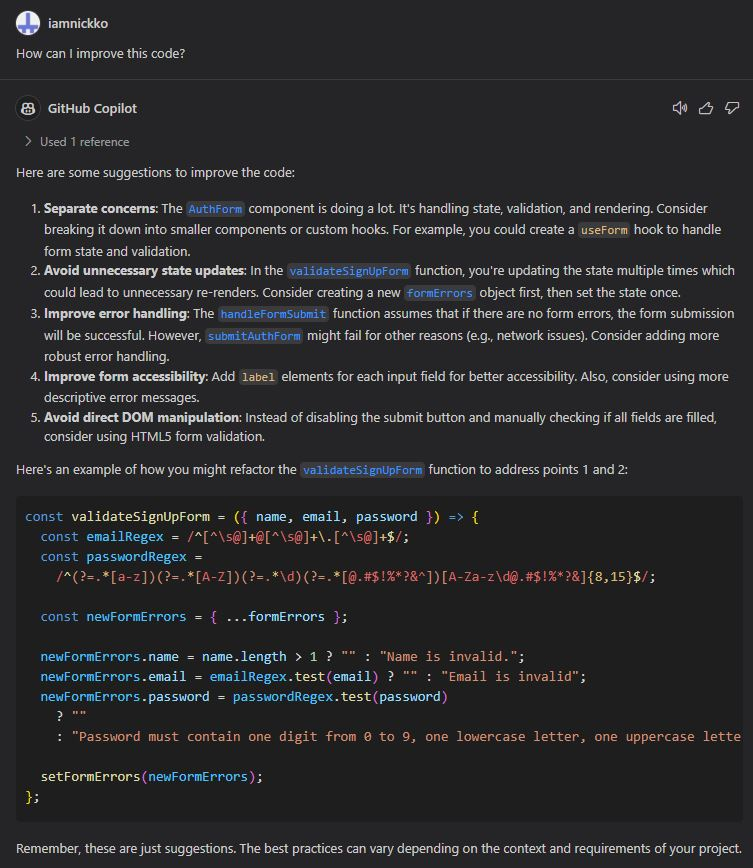
#### SE_CC_2_3
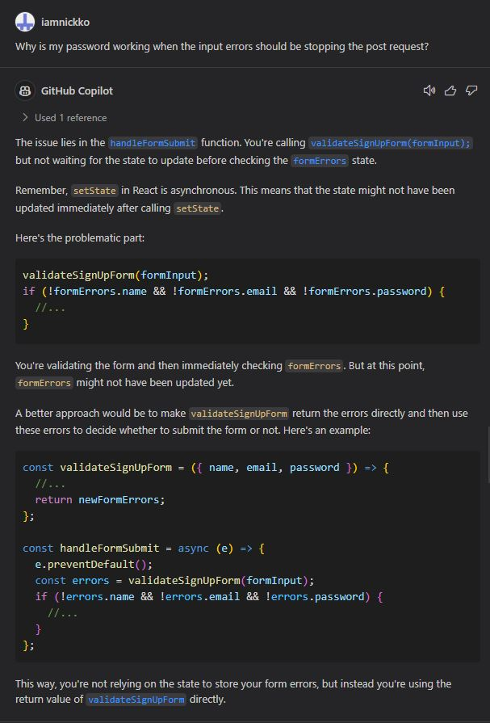
#### SE_CC_3_2
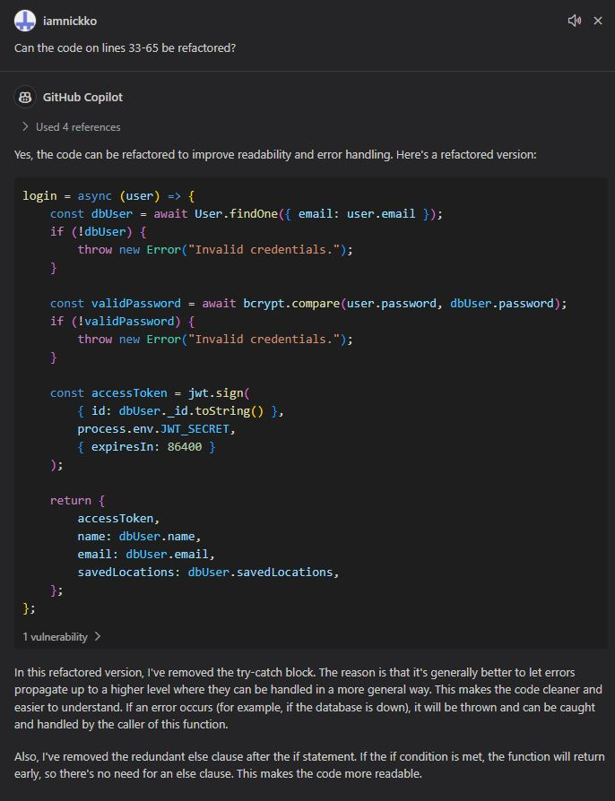
#### SE_CC_4_2
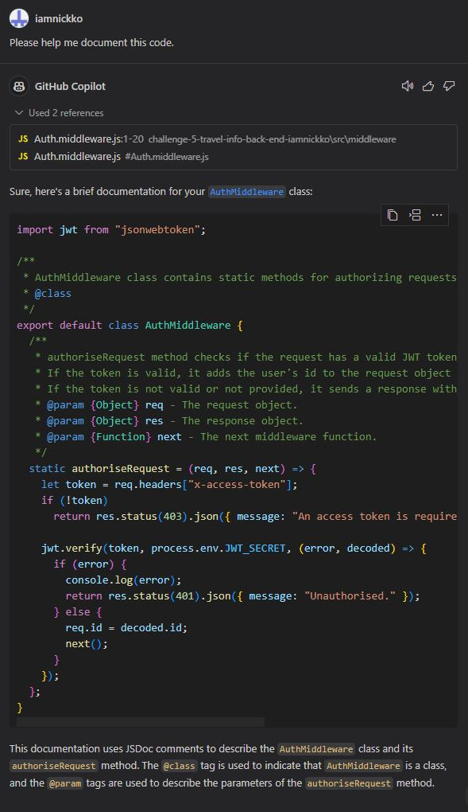
#### SE_TDD_5_2
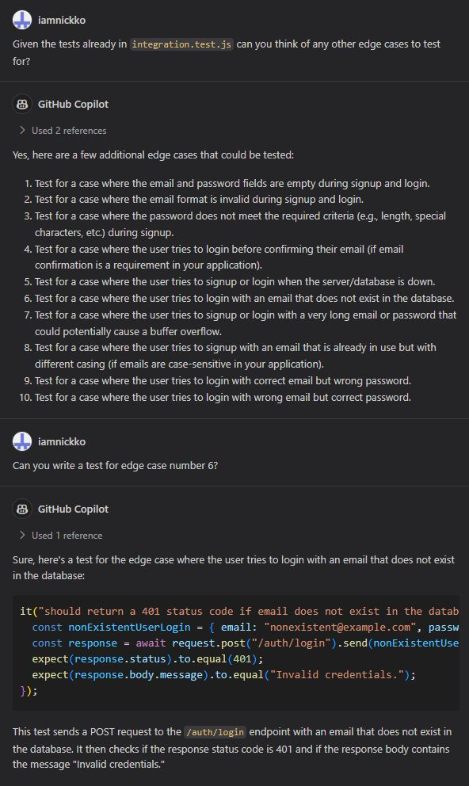

---